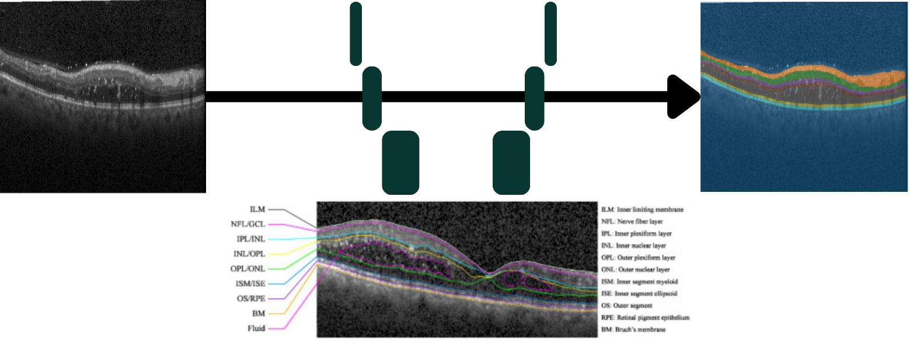
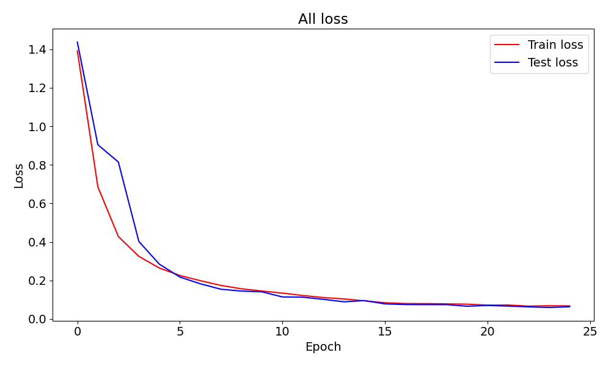
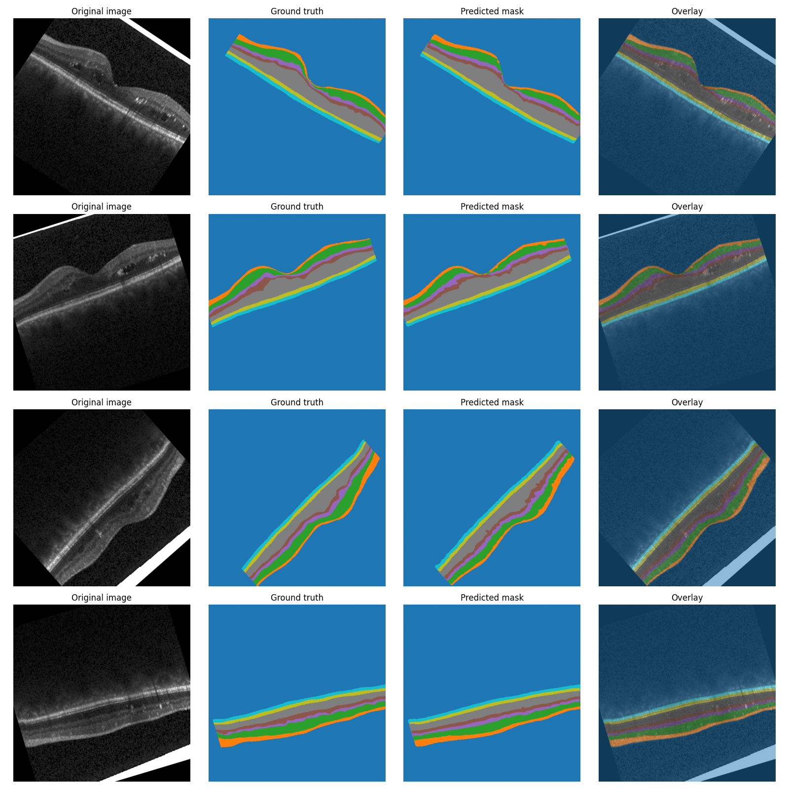

# 🏥 OCT AMD Biomarker Segmentation with U-Net

<p align="center">
  
</p>

<p align="center">
  
  
  
</p>

## 📋 Table of Contents
- [Overview](#overview)
- [Key Features](#key-features)
- [Architecture](#architecture)
- [Dataset](#dataset)
- [Results](#results)
<!-- - [Installation](#installation)
- [Quick Start](#quick-start)
- [Training](#training)
- [Evaluation](#evaluation) -->
- [Project Structure](#project-structure)
- [References](#references)
- [Author](#author)

---

## 🔬 Overview

This project implements **U-Net architecture** for automated segmentation of Age-related 
Macular Degeneration (AMD) retina layers in Optical Coherence Tomography (OCT) images.

AMD is the leading cause of irreversible blindness in elderly populations worldwide. 
Early and accurate detection of AMD biomarkers (layer thickness) is critical 
for timely intervention and treatment monitoring.

**Motivation**: This project was developed as part of my research in medical imaging 
and computer vision, demonstrating the application of deep learning for clinical 
diagnosis support.

### 🎯 Objectives
- Implement U-Net from scratch in PyTorch
- Segment AMD biomarkers from OCT scans with high accuracy
- Evaluate performance using clinical metrics (Dice, IoU, Accuracy)
- Create a reproducible and well-documented pipeline

---

## ✨ Key Features

✅ **Clean U-Net Implementation**
- Modern PyTorch implementation with best practices
- Modular and extensible architecture
- Clear separation of concerns (model, data, training, evaluation)

✅ **Medical Imaging Pipeline**
- Specialized preprocessing for OCT images
- Data augmentation tailored for medical imaging
- Clinical metrics (Dice coefficient, IoU, Accuracy)

✅ **Reproducibility**
- Seed setting for deterministic results
- Comprehensive logging and experiment tracking
<!-- - Docker support for environment consistency -->

✅ **Production-Ready**
- Inference API for deployment
- Model checkpointing and versioning
- Extensive documentation

---

## 🏗️ Architecture

### U-Net Overview

<p align="center">
  
</p>

**U-Net** (Ronneberger et al., 2015) is a convolutional neural network designed for 
biomedical image segmentation. Its architecture consists of:

1. **Encoder (Contracting Path)**: Captures context through progressive downsampling
2. **Bottleneck**: Learns high-level feature representations
3. **Decoder (Expanding Path)**: Enables precise localization through upsampling
4. **Skip Connections**: Preserves spatial information lost during downsampling

### Implementation Details
```python
Input: OCT Image (1 channel, 512×512)
    ↓
Encoder Blocks (64→128→256→512→1024 channels)
    ↓
Bottleneck (1024 channels)
    ↓
Decoder Blocks (1024→512→256→128→64 channels)
    ↓
Output: Segmentation Mask (3 classes, 512×512)
```

**Key Design Choices**:
- Batch Normalization for training stability
- ReLU activation functions
- Dropout (p=0.2) for regularization
- Adam optimizer with learning rate scheduling

<!-- For detailed architecture explanation, see [docs/architecture.md](docs/architecture.md) -->

---

## 📊 Dataset

### Source
- **Dataset**: [Dr. Stephanie Chiu - Duke University OCT Dataset](https://people.duke.edu/~sf59/Chiu_BOE_2014_dataset.htm) 
  (publicly available)
- **Size**: 110 OCT B-scans with expert annotations
- **Classes**: 8 (Back ground, NFL, GCL-IPL, INL, OPL, ONL-ISM, ISE, OS-RPE )
- **Resolution**: 496×768 pixels

### Preprocessing Pipeline

1. **Normalization**: Z-score normalization per image
2. **Resizing**: Standardized to 512×512
3. **Augmentation**:
   - Random horizontal flip (p=0.5)
   - Random rotation (±15°)
   - Random brightness/contrast adjustment
   - Elastic deformation

### Data Split
- Training: 80 images (70%)
- Validation: 15 images (15%)
- Test: 15 images (15%)

<!-- <p align="center">
  
</p> -->

---

## 🎯 Results

### Quantitative Results

| Metric | Score | Clinical Relevance |
|--------|-------|-------------------|
| **Dice Coefficient** | **0.874** | Excellent overlap with ground truth |
| **IoU (Jaccard)** | **0.783** | High spatial agreement |
| **Precision** | **0.876** | Low false positive rate |
| **Recall** | **0.888** | Low false negative rate (critical for screening) |
| **Pixel Accuracy** | **0.980** | Overall correctness |

### Learning Curves

<p align="center">
  
</p>

<!-- <p align="center">
  
</p> -->

### Qualitative Results

<p align="center">
  
</p>

**Interpretation**:
- ✅ Accurate detection of retina layers (critical for early AMD diagnosis)
- ✅ Accurate recognition of anomalies (important for treatment monitoring)
- ⚠️ Some under-segmentation in low-contrast regions (area for improvement)

<!-- For detailed results analysis, see [results/comparison_table.md](results/comparison_table.md) -->

---

## 🚀 Installation

### Prerequisites
- Python 3.9+
- CUDA 11.8+ (for GPU training)
- 8 GB+ RAM recommended

<!-- ### Setup
```bash
<i># Clone repository</i>
git clone https://github.com/AnesSAD/OCT-AMD-Segmentation.git
cd OCT-AMD-Segmentation

<i># Create virtual environment</i>
python -m venv venv
source venv/bin/activate  <i># On Windows: venv\Scripts\activate</i>

<i># Install dependencies</i>
pip install -r requirements.txt
```

### Docker (Alternative)
```bash
<i># Build image</i>
docker build -t oct-segmentation -f docker/Dockerfile .

<i># Run container</i>
docker run --gpus all -v $(pwd):/workspace oct-segmentation
```

---

## ⚡ Quick Start
### Setup
```bash
<i># Clone repository</i>
git clone https://github.com/AnesSAD/OCT-AMD-Segmentation.git
cd OCT-AMD-Segmentation

<i># Create virtual environment</i>
python -m venv venv
source venv/bin/activate  <i># On Windows: venv\Scripts\activate</i>

<i># Install dependencies</i>
pip install -r requirements.txt
```

### Docker (Alternative)
```bash
<i># Build image</i>
docker build -t oct-segmentation -f docker/Dockerfile .

<i># Run container</i>
docker run --gpus all -v $(pwd):/workspace oct-segmentation
```

---

## ⚡ Quick Start
### Setup
```bash
<i># Clone repository</i>
git clone https://github.com/AnesSAD/OCT-AMD-Segmentation.git
cd OCT-AMD-Segmentation

<i># Create virtual environment</i>
python -m venv venv
source venv/bin/activate  <i># On Windows: venv\Scripts\activate</i>

<i># Install dependencies</i>
pip install -r requirements.txt
```

### Docker (Alternative)
```bash
<i># Build image</i>
docker build -t oct-segmentation -f docker/Dockerfile .

<i># Run container</i>
docker run --gpus all -v $(pwd):/workspace oct-segmentation
```

---

## ⚡ Quick Start
### Setup
```bash
<i># Clone repository</i>
git clone https://github.com/AnesSAD/OCT-AMD-Segmentation.git
cd OCT-AMD-Segmentation

<i># Create virtual environment</i>
python -m venv venv
source venv/bin/activate  <i># On Windows: venv\Scripts\activate</i>

<i># Install dependencies</i>
pip install -r requirements.txt
```

### Docker (Alternative)
```bash
<i># Build image</i>
docker build -t oct-segmentation -f docker/Dockerfile .

<i># Run container</i>
docker run --gpus all -v $(pwd):/workspace oct-segmentation
```

--- -->

<!-- ## ⚡ Quick Start
### Setup
```bash
<i># Clone repository</i>
git clone https://github.com/AnesSAD/OCT-AMD-Segmentation.git
cd OCT-AMD-Segmentation

<i># Create virtual environment</i>
python -m venv venv
source venv/bin/activate  <i># On Windows: venv\Scripts\activate</i>

<i># Install dependencies</i>
pip install -r requirements.txt
```

### Docker (Alternative)
```bash
<i># Build image</i>
docker build -t oct-segmentation -f docker/Dockerfile .

<i># Run container</i>
docker run --gpus all -v $(pwd):/workspace oct-segmentation
```

---

## ⚡ Quick Start

### Inference on Sample Images
```bash
<i># Run inference on provided samples</i>
python src/inference.py \
    --model models/best_model.pth \
    --input data/sample/images/test_oct.png \
    --output results/predictions/test_oct_pred.png
```

**Expected output:**
```
Loading model... ✓
Processing image... ✓
Segmentation complete!
  - Dice Score: 0.853
  - IoU: 0.742
  - Inference time: 45 ms
Results saved to: results/predictions/test_oct_pred.png
```

### Interactive Jupyter Notebook
```bash
jupyter notebook notebooks/03_results_visualization.ipynb
```

This notebook provides:
- Interactive visualization of predictions
- Metric computation
- Comparison with ground truth

---

## 🎓 Training

### Training from Scratch
```bash
python src/train.py \
    --data_dir data/processed \
    --epochs 100 \
    --batch_size 8 \
    --learning_rate 0.0001 \
    --save_dir models/
```

### Training Configuration

Key hyperparameters (defined in `src/train.py`):
```python
BATCH_SIZE = 8
LEARNING_RATE = 1e-4
EPOCHS = 100
OPTIMIZER = Adam
LOSS_FUNCTION = Dice Loss + Cross Entropy (weighted 0.7/0.3)
SCHEDULER = ReduceLROnPlateau (patience=10, factor=0.5)
```

### Monitoring Training

Training logs and metrics are saved to `logs/` and can be visualized with TensorBoard:
```bash
tensorboard --logdir logs/
```

---

## 📈 Evaluation

### Evaluate on Test Set
```bash
python src/evaluate.py \
    --model models/best_model.pth \
    --data_dir data/processed/test \
    --output results/evaluation_report.json
```

### Metrics Computed

- **Dice Coefficient**: Primary metric for medical segmentation
- **IoU (Jaccard Index)**: Spatial overlap measure
- **Sensitivity (Recall)**: Critical for screening (minimize false negatives)
- **Specificity**: Minimize false positives
- **Hausdorff Distance**: Boundary accuracy (clinical relevance)

--- -->

## 📁 Project Structure
```
OCT-AMD-Segmentation/
├── src/                  # Source code
│   ├── model.py         # U-Net architecture
│   ├── dataset.py       # Data loading & augmentation
│   ├── train.py         # Training pipeline
│   ├── evaluate.py      # Evaluation & metrics
│   └── inference.py     # Inference script
├── notebooks/            # Jupyter notebooks
├── data/                 # Data directory
│   └── sample/          # Sample images (committed)
├── models/              # Trained models
├── results/             # Results & visualizations
├── tests/               # Unit tests
├── docs/                # Additional documentation
└── README.md            # This file
```

---

## 📚 References

### Key Papers

1. **U-Net**: Ronneberger, O., Fischer, P., & Brox, T. (2015). 
   <i>*U-Net: Convolutional Networks for Biomedical Image Segmentation*</i>. 
   MICCAI 2015. [Paper](https://arxiv.org/abs/1505.04597)

2. **AMD Detection**: Śpiewak, D., Drzyzga, Ł., Dorecka, M., & Wyględowska-Promieńska, D. (2024). Summary of the therapeutic options for patients with dry and neovascular AMD. Journal of Clinical Medicine, 13(14), 4227

3. **OCT Imaging**: S. J. Chiu, M. J. Allingham, P. S. Mettu, S. W. Cousins, J. A. Izatt, S. Farsiu, "Kernel regression based segmentation of optical coherence tomography images with diabetic macular edema", ( BIOMEDICAL OPTICS EXPRESS), 6(4), pp. 1172-1194, April, 2015   
### Datasets

- S. J. Chiu, M. J. Allingham, P. S. Mettu, S. W. Cousins, J. A. Izatt, S. Farsiu, "Kernel regression based segmentation of optical coherence tomography images with diabetic macular edema", ( BIOMEDICAL OPTICS EXPRESS), 6(4), pp. 1172-1194, April, 2015   

### Tools & Frameworks

- PyTorch: https://pytorch.org/
- OpenCV: https://opencv.org/
- scikit-image: https://scikit-image.org/

---

## 👨‍💻 Author

**Anes SADAOUI**

- 🎓 Mastère Spécialisé Big Data (UTT) | M2 Chimie Physique (Université Paris Cité)
- 🔬 Research Intern — Computer Vision @ CNRS ITODYS (6 months)
- 💼 Seeking 6-month internship in Medical AI / Computer Vision (March 2026)

**Contact**:
- 📧 Email: asadaoui.pro@gmail.com
- 💼 LinkedIn: [linkedin.com/in/anes-sadaoui](https://linkedin.com/in/anes-sadaoui)

---

## 📄 License

This project is licensed under the MIT License — see [LICENSE](LICENSE) file for details.

---

## 🙏 Acknowledgments

- CNRS ITODYS laboratory for research training
- Dr Stephanie Chiu and Pr. Sina Farsiu from Duke University for the dataset
- MCOvision for specific training of computer vision on medical imaging

---

## 🔮 Future Work

- [ ] Implement U-Net++ and Attention U-Net variants
- [ ] Implet U-Net for fluid detection on CTO images
- [ ] Ensemble methods for improved robustness
<!-- - [ ] Real-time inference optimization (ONNX, TensorRT) -->
- [ ] Integration with clinical PACS systems
<!-- - [ ] Active learning for efficient annotation -->

---

<!-- <p align="center">
  ⭐ If you find this project useful, please consider giving it a star! ⭐
</p> -->

<p align="center">
  Made with ❤️ for advancing medical AI
</p>